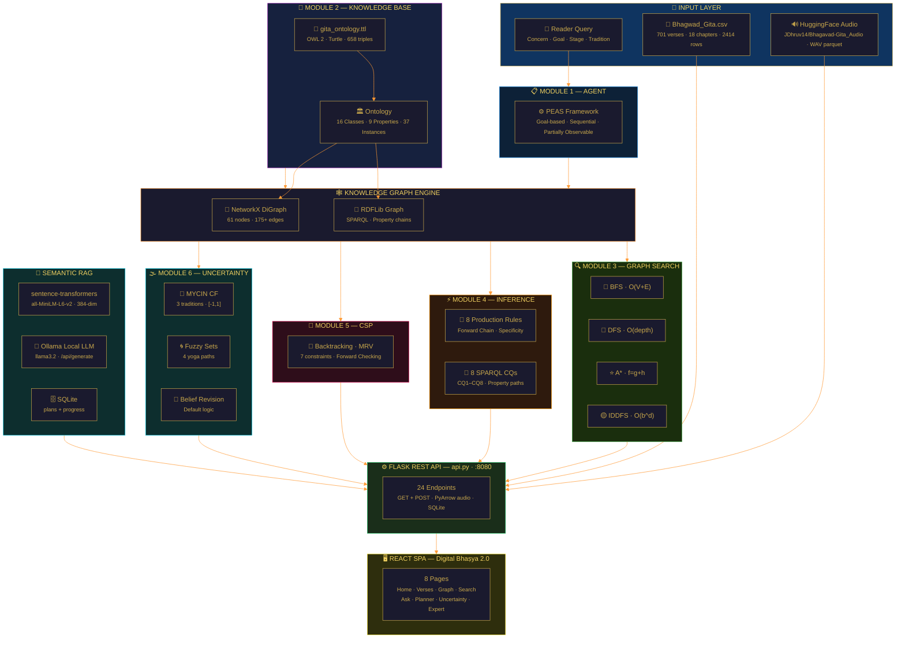
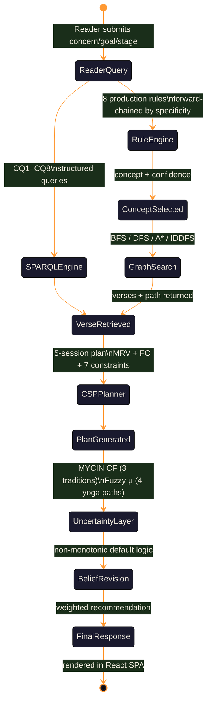
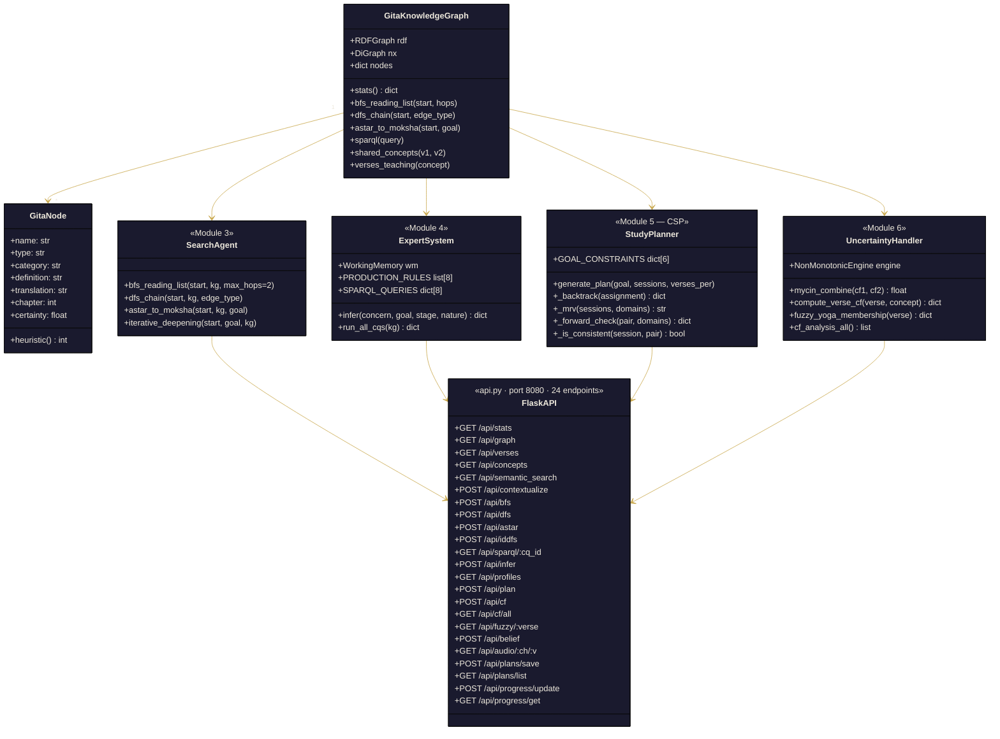
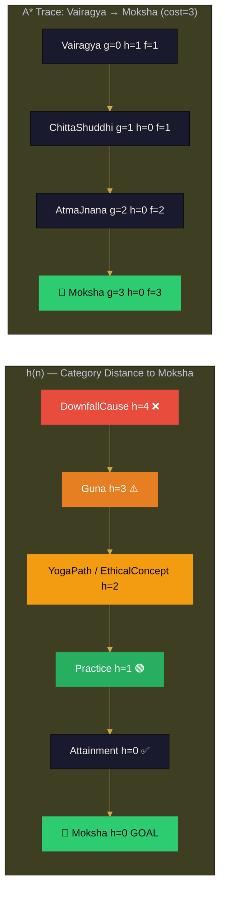
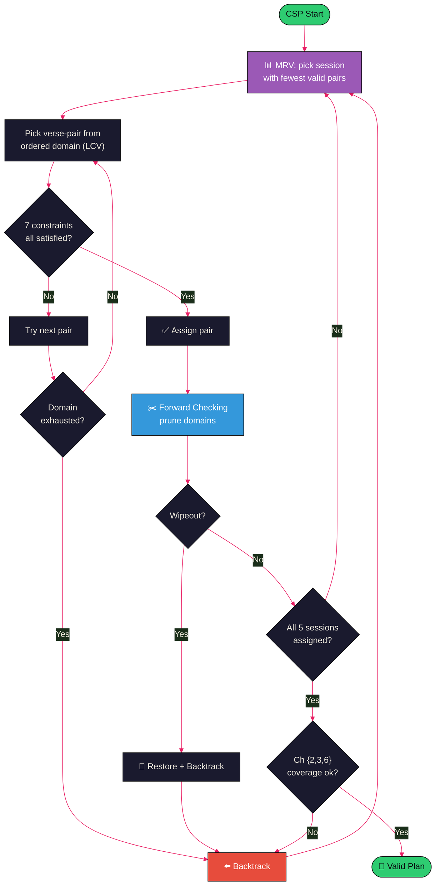

<div align="center">


# GitaGraph — Intelligent Gītā Navigator

### *An Ontology-Driven Knowledge-Based AI System for Philosophical Navigation of the Bhagavad Gītā*

[](https://python.org)
[](https://flask.palletsprojects.com)
[](https://react.dev)
[](https://vitejs.dev)
[](https://rdflib.readthedocs.io)
[](https://networkx.org)
[](https://www.w3.org/OWL/)
[](LICENSE)

> *"कर्मण्येवाधिकारस्ते मा फलेषु कदाचन"* — Bhagavad Gītā 2.47

**Resume Name:** `GitaGraph: Ontology-Driven AI System for Bhagavad Gītā Philosophical Navigation`

</div>

---

## 📌 What is GitaGraph?

**GitaGraph** is a full-stack, knowledge-based AI system that treats the Bhagavad Gītā as a structured philosophical knowledge graph. It applies six classical AI techniques — intelligent agent design, knowledge representation, graph search, logical inference, constraint satisfaction, and uncertainty reasoning — over a curated AI corpus of **30 verses** (Chapters 2, 3, 6) and **23 philosophical concepts** encoded as an **OWL 2 ontology** with **658 RDF triples**.

The system answers reader queries like *"I am anxious about my work — which verses should I read?"* through an intelligent pipeline: production rule inference → SPARQL retrieval → graph traversal → constraint-optimised study planning → certainty-weighted recommendations.

The **Digital Bhaṣya 2.0** front-end is a premium React 18 SPA served by a Flask REST API (24 endpoints), presenting all **701 verses** (18 chapters) with trilingual Sanskrit/Hindi/English display, verse audio recitation, transliteration, expandable word meanings and commentary, and full interactive interfaces for every AI module.

**v2.1 additions:** Semantic RAG search (384-dim sentence embeddings, cosine similarity over all 701 verses), Ollama local-LLM commentary (no API key required), SQLite user-state persistence (study plans + progress), IDDFS wired to Search UI, virtual scrolling for verse list, search history, verse comparison panel, flashcard quiz mode, print/export study plans, confidence-weighted knowledge graph edges, and mobile-responsive hamburger sidebar.

### 🏆 Highlight for Resume
```
GitaGraph | Python · OWL/RDF · SPARQL · NetworkX · Flask · React 18 · Vite · Ollama
• Built OWL 2 ontology (16 classes, 9 object properties incl. TransitiveProperty,
  SymmetricProperty, PropertyChain axiom) over 658 RDF triples encoding 30 Bhagavad
  Gītā verses and 23 philosophical concepts
• Implemented BFS, DFS, A* (admissible heuristic h=category-distance), and IDDFS over
  a directed knowledge graph of 61 nodes and 175+ edges; answered 8 SPARQL competency
  questions with full property-chain and transitive inference
• Designed Backtracking CSP solver with MRV heuristic and Forward Checking to generate
  5-session personalised study plans satisfying 7 hard constraints; added SQLite
  persistence for plan saving and per-verse progress tracking
• Applied MYCIN certainty factor combination across 3 commentary traditions (Śaṅkara,
  Rāmānuja, Madhva), fuzzy yoga-path membership over 4 paths, and non-monotonic belief
  revision with default logic; confidence factors drive D3 edge stroke-width in graph
• Added semantic RAG search: sentence-transformers all-MiniLM-L6-v2 (384-dim) over 701
  verses, cosine similarity ranking, fully local (no API key)
• Integrated Ollama local LLM for per-verse contextualised commentary (llama3.2)
• Engineered React 18 SPA (D3 v7, Framer Motion 11, TanStack Query v5, react-virtual)
  + Flask REST API (24 endpoints, port 8080) with HuggingFace audio dataset integration
```

---

## 🗺️ System Architecture



---

## 🔗 Knowledge Graph Structure

```mermaid
%%{init: {'theme': 'base', 'themeVariables': {'primaryColor': '#1A1A2E', 'primaryTextColor': '#EDE8DC', 'lineColor': '#C9A84C', 'edgeLabelBackground': '#1A1A2E'}}}%%
graph LR
    subgraph SPIRITUAL["✨ SPIRITUAL PROGRESSION CHAIN"]
        NK["NishkamaKarma<br/><small>Practice</small>"] -->|leadsTo| CS["ChittaShuddhi<br/><small>Attainment</small>"]
        VR["Vairagya<br/><small>Practice</small>"] -->|leadsTo| CS
        AB["Abhyasa<br/><small>Practice</small>"] -->|leadsTo| SM["Samadhi<br/><small>Attainment</small>"]
        DY["DhyanaYoga<br/><small>YogaPath</small>"] -->|leadsTo| SP["Sthitaprajna<br/><small>Attainment</small>"]
        CS & SP & SM -->|leadsTo| AJ["AtmaJnana<br/><small>Attainment</small>"]
        AJ -->|leadsTo| MK["🎯 Moksha"]
    end

    subgraph DOWNFALL["💀 DOWNFALL CHAIN (DFS trace)"]
        KA["Kama"] -->|leadsTo| KR["Krodha"]
        KR -->|leadsTo| MH["Moha"]
        MH -->|leadsTo| BN["BuddhiNasha ☠"]
    end

    subgraph CONTRAST["⚖️ CONTRASTS (SymmetricProperty)"]
        KY["KarmaYoga"] <-->|contrastsWith| SN["Sannyasa"]
        SD["Svadharma"] <-->|contrastsWith| PD["Paradharma"]
    end

    subgraph VERSE["📜 VERSE → CONCEPT (teaches)"]
        V247["2.47"] -->|teaches| NK
        V262["2.62"] -->|teaches| KA
        V263["2.63"] -->|teaches| KR
        V635["6.35"] -->|teaches| VR & AB
        V647["6.47"] -->|teaches| DY
    end

    style SPIRITUAL fill:#0D2E1A,stroke:#2ECC71
    style DOWNFALL fill:#2E0D0D,stroke:#E74C3C
    style CONTRAST fill:#1A0D2E,stroke:#9B59B6
    style VERSE fill:#2E1A0D,stroke:#C9A84C
    style MK fill:#2ECC71,color:#0A0A10,stroke:#2ECC71
    style BN fill:#E74C3C,color:#0A0A10,stroke:#E74C3C
```



---

## 🤖 Agent State Space



---

## 🏗️ Module Overview



---

## 🧠 OWL 2 Ontology

```mermaid
%%{init: {'theme': 'base', 'themeVariables': {'primaryColor': '#1A1A2E', 'lineColor': '#9C27B0', 'primaryTextColor': '#EDE8DC'}}}%%
graph TD
    subgraph CLASSES["📦 16 OWL 2 Classes"]
        OT["owl:Thing"]
        OT --> SE["ScripturalEntity"]
        OT --> PC["PhilosophicalConcept"]
        OT --> PE["Person"]
        OT --> CT["CommentaryTradition"]
        SE --> CH["Chapter (×3)"]
        SE --> VE["Verse (×30)"]
        PC --> YP["YogaPath"]
        PC --> PRA["Practice (×5)"]
        PC --> ATT["Attainment (×5)"]
        PC --> DC["DownfallCause (×4)"]
        PC --> GU["Guna (×3)"]
        PC --> EC["EthicalConcept (×3)"]
        YP --> KYP["KarmaYogaPath"]
        YP --> JYP["JnanaYogaPath"]
        YP --> DYP["DhyanaYogaPath"]
        YP --> BYP["BhaktiYogaPath"]
    end

    subgraph PROPS["🔗 9 Object Properties"]
        P1["teaches / taughtBy (inverse pair)"]
        P2["leadsTo ⚡ owl:TransitiveProperty"]
        P3["contrastsWith ↔ owl:SymmetricProperty"]
        P4["spirituallyProgressesTo<br/><small>PropertyChain: teaches ∘ leadsTo</small>"]
        P5["subConceptOf · requires · respondsTo<br/>spokenBy · belongsToChapter"]
    end

    subgraph INST["🔮 37 Instances · 658 Triples"]
        I1["30 Verse instances (2.47–6.47)"]
        I2["23 Concept instances"]
        I3["3 Chapter + 2 Speakers + 3 Traditions"]
    end

    style CLASSES fill:#1A0D2E,stroke:#9C27B0
    style PROPS fill:#0D1A2E,stroke:#2196F3
    style INST fill:#0D2E1A,stroke:#2ECC71
    style P2 fill:#2E1A0D,stroke:#FF9800,color:#F0D060
    style P3 fill:#0D2E1A,stroke:#4CAF50,color:#F0D060
    style P4 fill:#2E0D1A,stroke:#E91E63,color:#F0D060
```



---

## 🔢 A\* Heuristic



---

## 🎲 CSP Study Planner



**7 Hard Constraints:**

| # | Constraint | Description |
|---|---|---|
| 1 | Theme coherence | Verse pair must share ≥ 1 philosophical concept |
| 2 | Chapter coverage | Chapters {2, 3, 6} must each appear in ≥ 1 session |
| 3 | Prerequisite ordering | Verse 2.62 must appear before Verse 2.63 |
| 4 | Mandatory pair | {2.62, 2.63} (downfall chain) must be in the same session |
| 5 | No repetition | Each verse assigned to exactly one session |
| 6 | Goal deadline | Goal-specific verse must appear by a target session |
| 7 | Speaker variety | Include Arjuna verses where available |

---

## ⚡ Expert System — 8 Production Rules

| Rule | Condition | Fires → Concept | CF | Specificity |
|---|---|---|---|---|
| R1 | concern = anxiety | NishkamaKarma | 0.92 | 1 |
| R2 | goal = peace / equanimity | Sthitaprajna | 0.85 | 1 |
| R3 | NishkamaKarma + stage = beginner | Verse_2_47 | 0.95 | 3 |
| R4 | concern = anger / desire / lust | Kama | 0.90 | 2 |
| R5 | concern = meditation / dhyana / focus | Chapter 6 / Verse_6_10 | 0.95 | 2 |
| R6 | stage = advanced + goal = wisdom | JnanaYoga | 0.88 | 2 |
| R7 | nature = contemplative | Bhakti | 0.92 | 2 |
| R8 | concern = devotion / bhakti | BhaktiYoga | 0.94 | 2 |

---

## 🌫️ Uncertainty — MYCIN CF Formula

```
Both positive:   CF = CF₁ + CF₂ × (1 − CF₁)
Both negative:   CF = CF₁ + CF₂ × (1 + CF₁)
Mixed sign:      CF = (CF₁ + CF₂) / (1 − min(|CF₁|, |CF₂|))

Example — Verse 2.47 × KarmaYoga:
  Śaṅkara  = 0.40
  Rāmānuja = 0.95
  Madhva   = 0.80
  Combined CF = 0.9991  (Decisive/Strong)
```

**Fuzzy Yoga Membership (Verse 6.47):**
- BhaktiYogaPath: μ = 1.0
- DhyanaYogaPath: μ = 1.0
- JnanaYogaPath:  μ = 0.8
- KarmaYogaPath:  μ = 0.6

---

## 📦 Tech Stack

| Layer | Technology | Version | Purpose |
|---|---|---|---|
| **Knowledge Repr.** | OWL 2, RDF Turtle | — | 16 classes, 9 properties, 658 triples |
| **Ontology Engine** | RDFLib | 7.0+ | SPARQL endpoint, transitive/chain inference |
| **Graph Search** | NetworkX | 3.3+ | BFS · DFS · A* · IDDFS over 61-node digraph |
| **Logic / Rules** | Pure Python | — | 8-rule forward-chaining expert system |
| **CSP Solver** | Pure Python | — | Backtracking + MRV + FC, 7 constraints |
| **Uncertainty** | Pure Python | — | MYCIN CF · Fuzzy sets · Non-monotonic logic |
| **REST API** | Flask | 3.0+ | 24 endpoints, port 8080, PyArrow audio |
| **Audio Serving** | PyArrow | latest | Reads raw WAV bytes from parquet shards |
| **Semantic Search** | sentence-transformers | 3.0+ | all-MiniLM-L6-v2, 384-dim, cosine sim over 701 verses |
| **Local LLM** | Ollama | any | llama3.2 commentary via /api/generate — no API key |
| **User State** | SQLite | built-in | Study plans + per-verse progress, ON CONFLICT upsert |
| **Frontend** | React + Vite | 18.3.1 / 5.4.8 | SPA, dev proxy → Flask :8080 |
| **Virtualisation** | @tanstack/react-virtual | 3.x | Windowed verse list (700+ cards) |
| **Styling** | Tailwind CSS | 3.4.11 | Custom gold/indigo theme, glass morphism |
| **Animation** | Framer Motion | 11.5.4 | Page transitions, AnimatePresence |
| **Data Fetching** | TanStack Query | v5.56.2 | Caching, placeholderData, background refetch |
| **Graph Viz** | D3.js | 7.9.0 | Force-directed graph, CF-weighted edges |
| **Charts** | Recharts | 2.12.7 | CF bars, radar charts |
| **Icons** | Lucide React | 0.446.0 | SVG icon set |
| **Typography** | Playfair Display · Martel · Noto Serif Devanagari · Cinzel · Inter | Google Fonts | Scholarly English / authentic Devanagari |
| **Data** | Bhagwad_Gita.csv | 701 verses · 2,414 rows · 8 columns | Full Gītā corpus |
| **Audio Dataset** | HuggingFace parquet | ~3.3 GB · 18 shards | WAV recitation per shloka |
| **Legacy UI** | Streamlit | 1.35+ | Original single-page app (app.py) |

---

## 🎯 AI Concepts Demonstrated

| AI Concept | Module | Implementation |
|---|---|---|
| **Intelligent Agent (PEAS)** | M1 | Goal-based agent; partial/sequential/static/discrete env |
| **Knowledge Representation** | M2 | OWL 2 ontology: class hierarchy, object/data properties |
| **RDF / Semantic Web** | M2 | 658 Turtle triples; SPARQL property paths |
| **Transitive Property** | M2 | `leadsTo` → owl:TransitiveProperty; enables CQ3/CQ6 chain |
| **Symmetric Property** | M2 | `contrastsWith` → owl:SymmetricProperty; enables CQ5 |
| **Property Chain Axiom** | M2 | `teaches ∘ leadsTo → spirituallyProgressesTo` (OWL 2 RL) |
| **Breadth-First Search** | M3 | O(V+E); optimal reading-list up to N hops |
| **Depth-First Search** | M3 | O(depth); downfall chain tracer (Kama→BuddhiNasha) |
| **A\* Search** | M3 | Admissible h(n) = category-distance; optimal path to Moksha |
| **Iterative Deepening** | M3 | BFS completeness + DFS memory O(d) |
| **Forward Chaining** | M4 | 8 rules fired by specificity; fixpoint convergence |
| **SPARQL** | M4 | 8 CQs: CONSTRUCT, SELECT, property path (`leadsTo+`) |
| **First-Order Logic** | M4 | Horn clauses for `spirituallyProgressesTo`, transitivity |
| **Constraint Satisfaction** | M5 | Backtracking CSP; 7 hard constraints; 5-session plans |
| **MRV Heuristic** | M5 | Minimum Remaining Values for variable ordering |
| **Forward Checking** | M5 | Domain pruning after assignment; wipeout detection |
| **Certainty Factors** | M6 | MYCIN CF formula; 3 commentary traditions; range [-1,1] |
| **Fuzzy Logic** | M6 | μ(verse, YogaPath) ∈ [0,1]; 4 paths; linguistic labels |
| **Non-Monotonic Reasoning** | M6 | Default logic; belief retraction on new verse evidence |

---

## 📂 Project Structure

```
GitaGraph/
│
├── 📄 README.md                    ← This file
├── 📄 DOCUMENTATION.md             ← Full technical documentation (32 KB)
├── 📄 VIVA_QUESTIONS.md            ← 60+ viva Q&A in first person (48 KB)
├── 📄 requirements.txt             ← Python dependencies
├── 📄 Bhagwad_Gita.csv             ← 701 verses · 18 chapters · 2,414 rows
│                                      Columns: ID, Chapter, Verse, Shloka,
│                                      Transliteration, HinMeaning, EngMeaning, WordMeaning
│
├── 🖥️ api.py                       ← Flask REST API · port 8080 · 24 endpoints
│                                      Lazy-loads KG, CSV, audio; SQLite init; RAG + Ollama
├── 🖥️ app.py                       ← Legacy Streamlit UI (8-section SPA)
├── 📥 download_audio.py            ← HuggingFace dataset downloader
│                                      Resume-safe · tqdm progress · speed + ETA display
├── 📊 generate_embeddings.py       ← Builds verse_embeddings.npy + verse_index.json
│                                      sentence-transformers all-MiniLM-L6-v2 · 701 verses
├── 🌱 expand_ontology.py           ← LLM-assisted TTL ontology expansion (--dry-run flag)
│
├── 📁 audio_cache/                 ← Downloaded parquet shards (~3.3 GB) — git-ignored
│   └── *.parquet                   ← shloka_id → audio{bytes, path} (raw WAV)
│
├── 📁 embeddings/                  ← Semantic search vectors (generated locally)
│   ├── verse_embeddings.npy        ← float32 · shape=(701, 384) · L2-normalised
│   └── verse_index.json            ← 701 entries: key, chapter, verse, en, hi, sa
│
├── 🗄️ user_data.db                ← SQLite · plans + progress tables (auto-created)
│
├── 📁 knowledge_base/
│   └── 📜 gita_ontology.ttl        ← OWL 2 ontology · 874 lines
│                                      16 classes · 9 properties · 37 instances · 658 triples
│
├── 📁 modules/
│   ├── 🕸️ knowledge_graph.py       ← GitaNode + GitaKnowledgeGraph · 13 KB
│   ├── 🔍 search_agent.py          ← BFS · DFS · A* · IDDFS · 13 KB
│   ├── ⚡ expert_system.py         ← 8 rules · 8 SPARQL CQs · WorkingMemory · 18 KB
│   ├── 📅 study_planner.py         ← CSP backtracking · MRV · FC · 14 KB
│   └── 🌫️ uncertainty_handler.py  ← MYCIN CF · Fuzzy · NonMonotonicEngine · 22 KB
│
└── 📁 frontend/                    ← React 18 SPA — Digital Bhaṣya 2.0
    ├── index.html                  ← Google Fonts: Playfair · Martel · Cinzel · Inter · JetBrains Mono
    ├── package.json                ← React 18.3.1 · Vite 5.4.8 · TanStack Query v5
    ├── vite.config.js              ← /api/* proxied → http://localhost:8080
    ├── tailwind.config.js          ← Custom colors (gold/saffron/teal/crimson/bg/ink)
    │                                  Custom fonts (cinzel/playfair/dev/inter/mono)
    └── src/
        ├── main.jsx                ← BrowserRouter (v7 future flags) + QueryClient
        ├── App.jsx                 ← 8 routes · mobile hamburger sidebar · ambient bg
        ├── api.js                  ← Typed fetch wrappers for all 24 endpoints
        ├── index.css               ← .verse-sanskrit · .verse-english · .verse-hindi
        │                              .glass · .glass-gold · .nav-item · .section-title
        ├── components/
        │   ├── ui/                 ← Badge · Button · Card · CFBar · EmptyState
        │   │                          Gauge · MetricCard · Skeleton · Tabs
        │   └── layout/             ← Sidebar (8 nav, mobile close btn) · PageTransition
        └── pages/
            ├── Home.jsx            ← Stats cards · 6 module cards · PEAS table
            ├── Verses.jsx          ← 701 verses · virtual scroll · keyword/AI search toggle
            │                          Search history (localStorage) · chapter filter
            │                          Audio · transliteration · word meanings · commentary
            │                          Ollama commentary panel · verse comparison (pin ≤3)
            ├── Graph.jsx           ← D3 force-directed · CF-weighted edge thickness
            │                          Clickable verse nodes → /verses · category filter
            ├── Search.jsx          ← BFS / DFS / A* / IDDFS tabs · iteration trace
            ├── Ask.jsx             ← Chat inference · SPARQL CQs · Semantic RAG search
            ├── Planner.jsx         ← CSP plan · flashcard quiz mode · print/export
            │                          Save plan (SQLite) · verse progress chips
            ├── Uncertainty.jsx     ← CF panel · MYCIN formula · fuzzy radar · belief steps
            └── Expert.jsx          ← Reader profile cards · expandable rule base viewer
```

---

## ⚡ Quick Start

### 1 — Backend (Flask REST API)

```bash
pip install -r requirements.txt

# Start the API
python api.py
# Listening on http://127.0.0.1:8080
```

### 2 — Frontend (React SPA)

```bash
cd frontend
npm install
npm run dev
# Dev server at http://localhost:3000
# All /api/* requests proxied to http://localhost:8080
```

### 3 — Semantic Search (recommended, ~90 MB model download)

```bash
# First time only — generates 384-dim embeddings for all 701 verses
python generate_embeddings.py
# Output: embeddings/verse_embeddings.npy + embeddings/verse_index.json
```

### 4 — Ollama Commentary (optional, no API key needed)

```bash
# Install Ollama: https://ollama.com
ollama pull llama3.2    # ~2 GB — one-time download
ollama serve            # runs at http://localhost:11434
# Now the "Contextualize" button in Verse Browser works
```

### 5 — Audio Dataset (optional, ~3.3 GB)

```bash
python download_audio.py
# Downloads 18 parquet shards from JDhruv14/Bhagavad-Gita_Audio
# Resumes interrupted downloads automatically
```

### Legacy Streamlit UI

```bash
pip install streamlit plotly
streamlit run app.py
# http://localhost:8501
```

---

## 🖥️ UI Pages (React SPA)

| Page | Route | What It Does |
|---|---|---|
| 🏠 **Home** | `/` | Live stats (verses, triples, nodes, edges, modules), PEAS framework, 6 module cards |
| 📖 **Verses** | `/verses` | All 701 verses · virtual scroll · keyword/AI search toggle · search history chips · chapter dropdown · EN/HI/SA language pills · audio · transliteration · word meanings · Ollama commentary · pin ≤3 verses for side-by-side comparison |
| 🕸️ **Graph** | `/graph` | D3 force-directed knowledge graph · CF-weighted edge thickness · show/hide verses · category filter · click node for details · "Open in Verse Browser" for verse nodes |
| 🔍 **Search** | `/search` | BFS / DFS / A* / **IDDFS** · concept selector · hops slider · per-depth iteration trace · nodes-explored counter |
| 🧠 **Ask** | `/ask` | Chat inference with fired rules + CF · 8 SPARQL CQs with raw query display · **Semantic RAG** search (sentence-transformers, score bars, concept chips) |
| 📅 **Planner** | `/planner` | CSP study plan · 6 goal presets · session slider · **Save plan** (SQLite) · per-verse progress chips · **Flashcard quiz mode** · **Print/export** · My Saved Plans accordion |
| ❓ **Uncertainty** | `/uncertainty` | MYCIN CF computation (3 traditions) · combined CF bar · fuzzy yoga membership radar · non-monotonic belief revision steps |
| 💡 **Expert** | `/expert` | Expandable reader profile cards with inference trace · rule base sorted by specificity/CF · confidence gauges |

---

## 🔊 Audio Integration

Verse recitations are sourced from the [JDhruv14/Bhagavad-Gita_Audio](https://huggingface.co/datasets/JDhruv14/Bhagavad-Gita_Audio) HuggingFace dataset.

| Detail | Value |
|---|---|
| Dataset format | Parquet shards, 18 files, ~3.3 GB total |
| Key column | `shloka_id` (format `"1_1"`, `"2_47"`) |
| Audio column | `audio` → struct `{bytes: binary, path: string}` — raw WAV |
| Serving | Flask `/api/audio/<chapter>/<verse>` — PyArrow reads bytes directly, no decoder required |
| Caching | `Cache-Control: public, max-age=86400` (24 h browser cache) |
| Frontend | Per-verse `<AudioButton>` — states: `idle → playing → paused → ended` with stop/replay |

---

## 📊 Key Results

| Query / Algorithm | Result |
|---|---|
| BFS from `NishkamaKarma` (2 hops) | 7 verses: 2.47, 2.48, 2.71, 3.9, 3.19, 3.3, 3.35 |
| DFS downfall chain from `Kama` | Kama → Krodha → Moha → BuddhiNasha (4 nodes) |
| A\* from `Vairagya` → `Moksha` | 3 hops · cost=3: Vairagya → ChittaShuddhi → AtmaJnana → Moksha |
| A\* from `DhyanaYoga` → `Moksha` | 3 hops: DhyanaYoga → Samadhi → AtmaJnana → Moksha |
| MYCIN CF: Verse 2.47 × KarmaYoga | Śaṅkara=0.40, Rāmānuja=0.95, Madhva=0.80 → Combined **0.9991** |
| Fuzzy: Verse 6.47 | BhaktiYoga=1.0, DhyanaYoga=1.0, JnanaYoga=0.8, KarmaYoga=0.6 |
| CSP: Meditation plan | 5 sessions · chapters {2,3,6} covered · all 7 constraints satisfied |
| SPARQL CQ8 (Property Chain) | `spirituallyProgressesTo` infers verse→Moksha via teaches∘leadsTo |
| RDF Knowledge Base | 658 triples · 61 nodes · 175+ edges · 37 instances |

---

## 📜 The 30-Verse AI Corpus

| Chapter | Title | Verses included | Core AI themes |
|---|---|---|---|
| **2 — Sāṅkhya Yoga** | Philosophy of Self | 2.47, 2.48, 2.50, 2.55, 2.56, 2.62, 2.63, 2.64, 2.68, 2.71 | NishkamaKarma · Sthitaprajna · Downfall chain |
| **3 — Karma Yoga** | Selfless Action | 3.3, 3.4, 3.5, 3.8, 3.9, 3.19, 3.27, 3.35, 3.42, 3.43 | Svadharma · Gunas · Yajna |
| **6 — Dhyāna Yoga** | Meditation Practice | 6.5, 6.10, 6.13, 6.17, 6.18, 6.20, 6.23, 6.25, 6.35, 6.47 | Abhyasa · Vairagya · Samadhi |

---

<div align="center">

### *"योगः कर्मसु कौशलम्" — Yoga is excellence in action. (Gītā 2.50)*

Built with 🪷 by [DevRaviX](https://github.com/DevRaviX) | AI Minor Project

[](https://github.com/DevRaviX)

</div>
