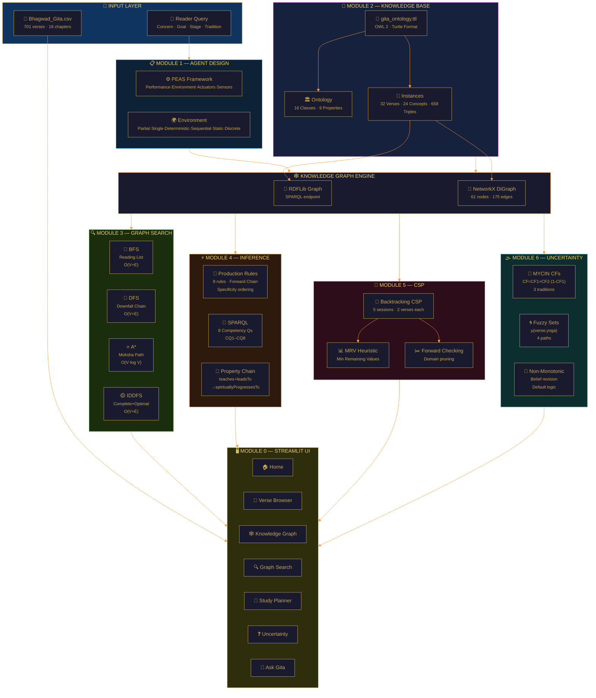
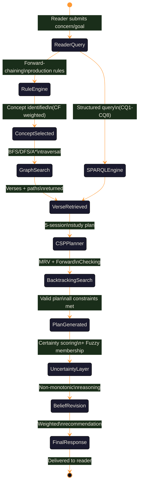
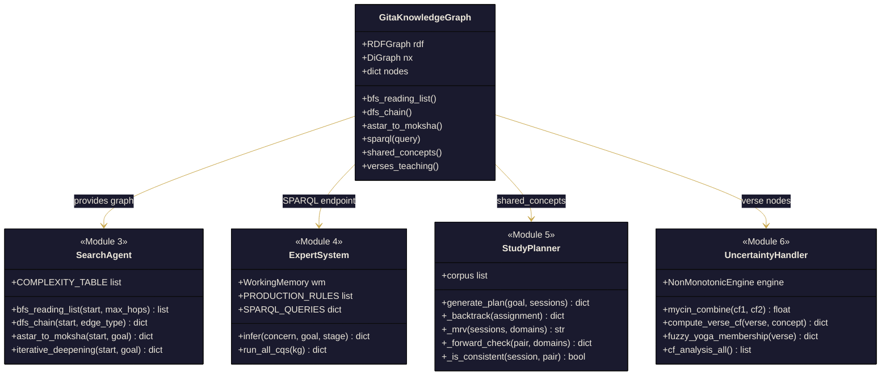
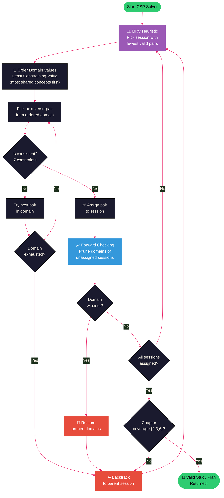
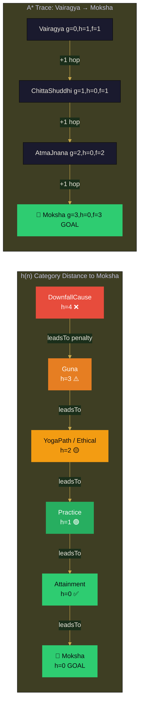

<div align="center">


# GitaGraph — Intelligent Gītā Navigator

### *An Ontology-Driven Knowledge-Based AI System for Philosophical Navigation of the Bhagavad Gītā*

[](https://python.org)
[](https://streamlit.io)
[](https://rdflib.readthedocs.io)
[](https://networkx.org)
[](https://www.w3.org/OWL/)
[](LICENSE)

> *"कर्मण्येवाधिकारस्ते मा फलेषु कदाचन"* — Bhagavad Gītā 2.47

**Resume Name:** `GitaGraph: Ontology-Driven AI System for Bhagavad Gītā Philosophical Navigation`

</div>

---

## 📌 What is GitaGraph?

**GitaGraph** is a full-stack knowledge-based AI system that treats the Bhagavad Gītā as a structured philosophical knowledge graph. It applies six classical AI techniques — knowledge representation, graph search, logical inference, constraint satisfaction, and uncertainty reasoning — over a curated corpus of **30 verses** (Chapters 2, 3, 6) and **24 philosophical concepts** encoded as an **OWL 2 ontology** with **658 RDF triples**.

The system answers reader queries like *"I am anxious about my work — which verses should I read?"* through an intelligent pipeline: production rule inference → SPARQL retrieval → graph traversal → constraint-optimised study planning → certainty-weighted recommendations.

### 🏆 Highlight for Resume
```
GitaGraph | Python · OWL/RDF · SPARQL · NetworkX · Streamlit
• Built OWL 2 ontology (16 classes, 9 object properties incl. TransitiveProperty,
  SymmetricProperty, PropertyChain axiom) over 658 RDF triples encoding 30 Bhagavad
  Gītā verses and 24 philosophical concepts
• Implemented BFS, DFS, and A* (admissible heuristic) over a directed knowledge graph
  of 61 nodes and 175 edges to answer 8 philosophical competency questions
• Designed Backtracking CSP solver with MRV heuristic and Forward Checking to generate
  5-session personalised study plans satisfying 7 hard constraints
• Applied MYCIN certainty factor combination (CF = 0.9991 for Karma Yoga), fuzzy
  yoga-path membership, and non-monotonic belief revision across 3 commentary traditions
```

---

## 🗺️ System Architecture



---

## 🔗 Knowledge Graph Structure

```mermaid
%%{init: {'theme': 'base', 'themeVariables': {'primaryColor': '#1A1A2E', 'primaryTextColor': '#EDE8DC', 'lineColor': '#C9A84C', 'edgeLabelBackground': '#1A1A2E'}}}%%

graph LR
    subgraph SPIRITUAL["✨ SPIRITUAL PROGRESSION CHAIN"]
        NK["NishkamaKarma<br/><small>Practice</small>"] -->|leadsTo| CS["ChittaShuddhi<br/><small>Attainment</small>"]
        VR["Vairagya<br/><small>Practice</small>"] -->|leadsTo| CS
        AB["Abhyasa<br/><small>Practice</small>"] -->|leadsTo| SM["Samadhi<br/><small>Attainment</small>"]
        DY["DhyanaYoga<br/><small>YogaPath</small>"] -->|leadsTo| SP["Sthitaprajna<br/><small>Attainment</small>"]
        CS -->|leadsTo| AJ["AtmaJnana<br/><small>Attainment</small>"]
        SP -->|leadsTo| AJ
        SM -->|leadsTo| AJ
        AJ -->|leadsTo| MK["🎯 Moksha<br/><small>Liberation</small>"]
    end

    subgraph DOWNFALL["💀 DOWNFALL CHAIN"]
        KA["Kama<br/><small>Desire</small>"] -->|leadsTo| KR["Krodha<br/><small>Anger</small>"]
        KR -->|leadsTo| MH["Moha<br/><small>Delusion</small>"]
        MH -->|leadsTo| BN["BuddhiNasha<br/><small>Ruin of Intellect</small>"]
    end

    subgraph CONTRAST["⚖️ CONTRASTS"]
        KY["KarmaYoga"] <-->|contrastsWith| SN["Sannyasa"]
        SD["Svadharma"] <-->|contrastsWith| PD["Paradharma"]
    end

    subgraph VERSE["📜 VERSE CONNECTIONS"]
        V247["Verse 2.47"] -->|teaches| NK
        V262["Verse 2.62"] -->|teaches| KA
        V263["Verse 2.63"] -->|teaches| KR
        V635["Verse 6.35"] -->|teaches| VR
        V635 -->|teaches| AB
        V647["Verse 6.47"] -->|teaches| DY
    end

    style SPIRITUAL fill:#0D2E1A,stroke:#2ECC71
    style DOWNFALL fill:#2E0D0D,stroke:#E74C3C
    style CONTRAST fill:#1A0D2E,stroke:#9B59B6
    style VERSE fill:#2E1A0D,stroke:#C9A84C
    style MK fill:#2ECC71,color:#0A0A10,stroke:#2ECC71
    style BN fill:#E74C3C,color:#0A0A10,stroke:#E74C3C
```



---

## 🤖 Agent State Space



---

## 🏗️ Module Overview



---

## 🧠 OWL Ontology Design

```mermaid
%%{init: {'theme': 'base', 'themeVariables': {'primaryColor': '#1A1A2E', 'lineColor': '#9C27B0', 'primaryTextColor': '#EDE8DC'}}}%%

graph TD
    subgraph CLASSES["📦 OWL 2 Class Hierarchy — 16 Classes"]
        OWL_THING["owl:Thing"]
        OWL_THING --> SE["ScripturalEntity"]
        OWL_THING --> PC["PhilosophicalConcept"]
        OWL_THING --> PR["Person"]
        OWL_THING --> CT["CommentaryTradition"]
        SE --> CH["Chapter ×3"]
        SE --> VE["Verse ×32"]
        PC --> YP["YogaPath"]
        PC --> PRA["Practice ×5"]
        PC --> ATT["Attainment ×5"]
        PC --> DC["DownfallCause ×4"]
        PC --> GU["Guna ×3"]
        PC --> EC["EthicalConcept ×3"]
        YP --> KYP["KarmaYogaPath"]
        YP --> JYP["JnanaYogaPath"]
        YP --> DYP["DhyanaYogaPath"]
        YP --> BYP["BhaktiYogaPath"]
    end

    subgraph PROPS["🔗 Key OWL Properties"]
        P1["leadsTo<br/><small>⚡ owl:TransitiveProperty</small>"]
        P2["contrastsWith<br/><small>↔ owl:SymmetricProperty</small>"]
        P3["spirituallyProgressesTo<br/><small>🔗 PropertyChain: teaches∘leadsTo</small>"]
        P4["teaches · respondsTo · spokenBy<br/>belongsToChapter · subConceptOf · requires"]
    end

    style CLASSES fill:#1A0D2E,stroke:#9C27B0
    style PROPS fill:#0D1A2E,stroke:#2196F3
    style P1 fill:#2E1A0D,stroke:#FF9800,color:#F0D060
    style P2 fill:#0D2E1A,stroke:#4CAF50,color:#F0D060
    style P3 fill:#2E0D1A,stroke:#E91E63,color:#F0D060
```



---

## 🎲 CSP Study Planner



---

## 🔢 A\* Heuristic Visualised



---

## 📦 Tech Stack

| Layer | Technology | Purpose |
|---|---|---|
| **Knowledge Representation** | OWL 2, RDF (Turtle) | Encode 16 classes, 9 object properties, 658 triples |
| **Ontology Reasoning** | RDFLib 7.0 (Python), Apache Jena Fuseki (optional) | Parse TTL, SPARQL endpoint, transitive/chain inference |
| **SPARQL** | rdflib.plugins.sparql, SPARQLWrapper | Answer 8 competency questions (CQ1–CQ8) |
| **Graph Search** | NetworkX 3.3 | BFS · DFS · A* · IDDFS over 61-node directed graph |
| **Logic / Rules** | Pure Python | Forward-chaining 8-rule expert system, specificity ordering |
| **CSP Solver** | Pure Python | Backtracking + MRV + Forward Checking, 7 constraints |
| **Uncertainty** | Pure Python | MYCIN CF formula · Fuzzy sets · Non-monotonic default logic |
| **UI Framework** | Streamlit 1.35 | 8-page interactive app with real-time graph queries |
| **Visualization** | Plotly 5.22 | Interactive knowledge graph, radar charts, timeline bars |
| **Data** | CSV (701 verses, 18 chapters) | Full Bhagavad Gītā corpus for verse browser |
| **Language** | Python 3.11+ | All algorithmic implementation |

---

## 🎯 AI Concepts Demonstrated

| AI Concept | Module | Implementation |
|---|---|---|
| **Intelligent Agent (PEAS)** | Module 1 | Goal-based agent over partially-observable sequential environment |
| **Knowledge Representation** | Module 2 | OWL 2 ontology with class hierarchy, object/data properties |
| **RDF / Semantic Web** | Module 2 | 658 Turtle triples, Fuseki-compatible SPARQL endpoint |
| **Transitive Property** | Module 2 | `leadsTo` as `owl:TransitiveProperty` — enables CQ6 chain inference |
| **Symmetric Property** | Module 2 | `contrastsWith` as `owl:SymmetricProperty` — enables CQ5 |
| **Property Chain Axiom** | Module 2 | `teaches ∘ leadsTo → spirituallyProgressesTo` (OWL 2 RL) |
| **Breadth-First Search** | Module 3 | O(V+E) reading-list generator, optimal min-hops |
| **Depth-First Search** | Module 3 | O(depth) downfall chain tracer, CQ3 |
| **A\* Search** | Module 3 | Admissible heuristic h(n)=category-distance, optimal path to Moksha |
| **Iterative Deepening** | Module 3 | Combines BFS completeness + DFS memory O(d) |
| **Forward Chaining** | Module 4 | Production rules fired by specificity, fixpoint convergence |
| **SPARQL** | Module 4 | 8 CQs including CONSTRUCT, property paths (`leadsTo+`) |
| **First-Order Logic** | Module 4 | Horn clauses for `spirituallyProgressesTo`, `leadsTo` transitivity |
| **Constraint Satisfaction** | Module 5 | Backtracking CSP with 7 hard constraints |
| **MRV Heuristic** | Module 5 | Minimum Remaining Values for variable ordering |
| **Forward Checking** | Module 5 | Domain pruning after each assignment, wipeout detection |
| **Certainty Factors (MYCIN)** | Module 6 | `CF = CF1 + CF2·(1−CF1)` combining 3 commentary traditions |
| **Fuzzy Logic** | Module 6 | μ(verse, YogaPath) ∈ [0,1], linguistic labels, radar visualization |
| **Non-Monotonic Reasoning** | Module 6 | Default logic, belief retraction on new verse evidence |
| **Semantic Graph Traversal** | All | Combined BFS/DFS/A* over RDF-backed NetworkX directed graph |

---

## 📂 Project Structure

```
GitaGraph/
│
├── 📄 README.md                    ← Architecture · Tech Stack · Concepts
├── 📄 DOCUMENTATION.md             ← Full project documentation
├── 📄 VIVA_QUESTIONS.md            ← 60+ viva Q&A in first person
├── 📄 requirements.txt
├── 🖥️ app.py                       ← Premium Streamlit UI (8 pages, animated)
│
├── 📁 knowledge_base/
│   └── 📜 gita_ontology.ttl        ← OWL 2 + 32 verse instances (658 triples)
│
└── 📁 modules/
    ├── __init__.py
    ├── 🕸️ knowledge_graph.py        ← RDFLib + NetworkX graph loader
    ├── 🔍 search_agent.py           ← Module 3: BFS · DFS · A* · IDDFS
    ├── ⚡ expert_system.py          ← Module 4: Production rules + SPARQL CQs
    ├── 📅 study_planner.py          ← Module 5: CSP backtracking + MRV + FC
    └── 🌫️ uncertainty_handler.py   ← Module 6: CF + Fuzzy + Non-monotonic
```

---

## ⚡ Quick Start

```bash
# Clone the repository
git clone https://github.com/DevRaviX/gitagraph.git
cd gitagraph

# Install dependencies
pip install -r requirements.txt

# Launch the app
streamlit run app.py
```

The app will open at **http://localhost:8501**

### Run individual modules
```bash
# Module 3: Graph Search
python3 modules/search_agent.py

# Module 4: Expert System
python3 modules/expert_system.py

# Module 5: Study Planner
python3 modules/study_planner.py

# Module 6: Uncertainty
python3 modules/uncertainty_handler.py
```

---

## 📊 Key Results

| Search / Query | Result |
|---|---|
| BFS from `NishkamaKarma` (2 hops) | 7 verses: 2.47, 2.48, 2.71, 3.9, 3.19, 3.3, 3.35 |
| DFS downfall chain from `Kama` | Kama → Krodha → Moha → BuddhiNasha (4 nodes) |
| A* from `Vairagya` → `Moksha` | 3 hops: Vairagya → ChittaShuddhi → AtmaJnana → Moksha |
| A* from `DhyanaYoga` → `Moksha` | 3 hops: DhyanaYoga → Samadhi → AtmaJnana → Moksha |
| MYCIN CF: Verse 2.47 → KarmaYoga | CF = 0.9991 (Strong) |
| Fuzzy: Verse 6.47 → Yoga paths | BhaktiYoga=1.0, DhyanaYoga=1.0, JnanaYoga=0.8 |
| CSP: Meditation study plan | 5 sessions, chapters {2,3,6} all covered |
| RDF Knowledge Base | 658 triples · 61 nodes · 175 edges |

---

## 🖥️ UI Pages

| Page | Module | Features |
|---|---|---|
| 🏠 Home | M1 | PEAS framework, metrics, module overview |
| 📖 Verse Browser | Data | All 701 verses, search, chapter filter, language toggle |
| 🕸️ Knowledge Graph | M2 | Interactive Plotly graph, 3 layouts, color-coded categories |
| 🔍 Graph Search | M3 | BFS/DFS/A* interactive runners with f-value traces |
| 🧠 Ask the Gītā | M4 | 8 SPARQL CQs + NL query → expert system inference |
| 📅 Study Planner | M5 | CSP plan generator with timeline chart |
| ❓ Uncertainty | M6 | CF bars, fuzzy radar chart, belief revision demo |
| 💡 Expert System | M4 | Rule base viewer, 4 reader profile demos |

---

## 📜 The 30-Verse Corpus

| Chapter | Title | Verses | AI Theme |
|---|---|---|---|
| **2 — Sāṅkhya Yoga** | Philosophy of Self | 2.47, 2.48, 2.50, 2.55, 2.56, 2.62, 2.63, 2.64, 2.68, 2.71 | Nishkama Karma, Sthitaprajna, Downfall Chain |
| **3 — Karma Yoga** | Selfless Action | 3.3, 3.4, 3.5, 3.8, 3.9, 3.19, 3.27, 3.35, 3.42, 3.43 | Svadharma, Gunas, Yajna |
| **6 — Dhyāna Yoga** | Meditation Practice | 6.5, 6.10, 6.13, 6.17, 6.18, 6.20, 6.23, 6.25, 6.35, 6.47 | Abhyasa, Vairagya, Samadhi |

---

<div align="center">

### *"योगः कर्मसु कौशलम्" — Yoga is excellence in action. (Gītā 2.50)*

Built with 🪷 by [DevRaviX](https://github.com/DevRaviX) | AI Minor Project

[](https://github.com/DevRaviX)

</div>
