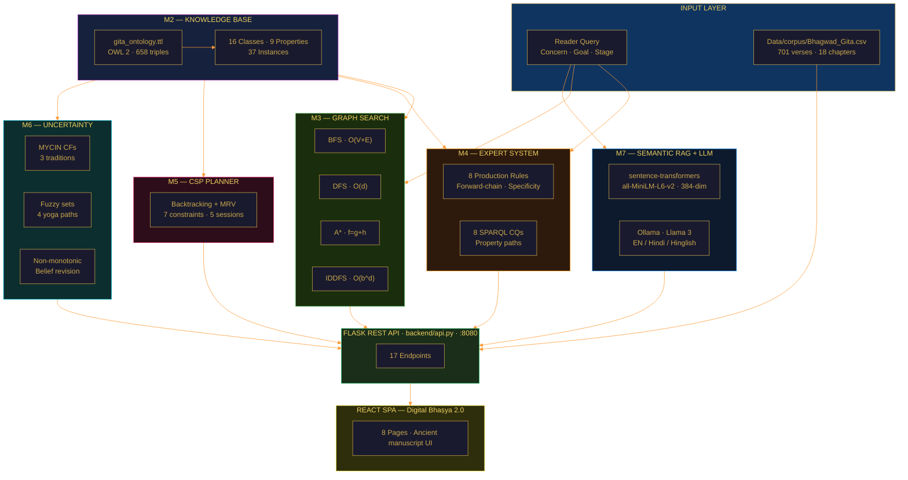

<div align="center">


# GitaGraph — Ontology-Driven AI System for the Bhagavad Gītā

### *Hybrid Neural–Symbolic Navigation of 700 Sanskrit Verses*

[](https://python.org)
[](https://flask.palletsprojects.com)
[](https://react.dev)
[](https://vitejs.dev)
[](https://rdflib.readthedocs.io)
[](https://networkx.org)
[](https://www.w3.org/OWL/)
[](LICENSE)

> *"कर्मण्येवाधिकारस्ते मा फलेषु कदाचन"* — Bhagavad Gītā 2.47

</div>

---

## What is GitaGraph?

**GitaGraph** is a full-stack, knowledge-based AI system that models the Bhagavad Gītā as a semantic knowledge graph and extends it with hybrid neural–symbolic reasoning. It answers questions like *"I feel anxious — which verse should I read?"* by running a complete AI pipeline: OWL inference → expert system → graph traversal → CSP study planning → semantic RAG → local LLM commentary.

The **Digital Bhaṣya 2.0** frontend is a React 18 SPA served by a Flask REST API, featuring an ancient manuscript-inspired UI with illuminated verse cards, parchment textures, and Cinzel typography — presenting all **701 verses** across 18 chapters with trilingual Sanskrit / Hindi / English display.

### Seven AI Modules

| Module | Technique | Key Stats |
|---|---|---|
| **M1 — Agent** | PEAS framework, goal-based agent | Partially observable, sequential, discrete |
| **M2 — Knowledge Base** | OWL 2 ontology + SPARQL | 658 RDF triples · 16 classes · 9 properties |
| **M3 — Graph Search** | BFS · DFS · A\* · IDDFS | 61-node, 175-edge concept graph |
| **M4 — Expert System** | Forward-chaining production rules | 9 rules · 8 SPARQL CQs · Hindi/Hinglish |
| **M5 — Study Planner** | CSP backtracking + MRV + FC | 7 hard constraints · 5-session plans |
| **M6 — Uncertainty** | MYCIN CFs · Fuzzy logic · NMR | 3 commentary traditions |
| **M7 — Semantic RAG + LLM** | sentence-transformers + NumPy cosine search + Ollama | 701 verses · EN/Hindi/Hinglish commentary |

## Run in 60 Seconds

```bash
pip install -r requirements.txt
python run.py --api-only
```

Then verify the backend:

```bash
curl http://127.0.0.1:8080/api/stats
```

For the React UI:

```bash
cd frontend && npm install
cd ..
python run.py
```

Open `http://127.0.0.1:3000`. The API runs on `http://127.0.0.1:8080`.

## Core Execution Path

```text
Reader query -> Flask API -> shared knowledge graph -> reasoning module
             -> verse evidence enrichment -> JSON response -> React UI
```

## What This System Actually Does

**Input:** a reader's concern or question  
**Output:** relevant Bhagavad Gītā verses, the inferred concept, confidence, and a reasoning trace

Pipeline:

1. Map concern to concept with expert rules.
2. Retrieve supporting verses with graph search and semantic RAG.
3. Explain the path through ontology-backed reasoning.

Use `POST /api/solve` for the end-to-end AI answer. The lower-level endpoints are kept visible so reviewers can inspect each reasoning module independently:

| Question | Entry point | Core module |
|---|---|---|
| "Give me one complete answer." | `POST /api/solve` | `backend/modules/query_pipeline.py` |
| "What should I read for my concern?" | `POST /api/infer` | `backend/modules/expert_system.py` |
| "Which verses are near this concept?" | `POST /api/bfs` | `backend/modules/search_agent.py` |
| "How does this concept lead to Moksha?" | `POST /api/astar` | `backend/modules/search_agent.py` |
| "Can you make a study plan?" | `POST /api/plan` | `backend/modules/study_planner.py` |
| "How certain is this interpretation?" | `POST /api/cf` | `backend/modules/uncertainty_handler.py` |
| "Find semantically similar verses." | `GET /api/semantic_search` | `Data/embeddings/` + `backend/api.py` |

See [Docs/guides/ARCHITECTURE.md](Docs/guides/ARCHITECTURE.md) for the full pipeline, [Docs/guides/EXAMPLES.md](Docs/guides/EXAMPLES.md) for three end-to-end qualitative outputs, and [Docs/guides/RUNTIME.md](Docs/guides/RUNTIME.md) for verified run commands.

## End-to-End Example

```bash
curl -s -X POST http://127.0.0.1:8080/api/solve \
  -H "Content-Type: application/json" \
  -d '{
    "query":"I feel anxious about the results of my work",
    "goal":"peace",
    "stage":"beginner",
    "nature":"active",
    "include_semantic":false
  }'
```

Expected reasoning:

```text
Concern -> R1_AnxietyResults -> NishkamaKarma
Beginner + NishkamaKarma -> R3_BeginnerNishkama -> Verse_2_47
Graph BFS -> nearby supporting verses such as 2.48, 3.9, and 3.19
```

Shortened response shape:

```json
{
  "recommend_concept": "NishkamaKarma",
  "confidence": 0.95,
  "reasoning_steps": [
    {"step": "map_concern_to_concept", "result": "NishkamaKarma"},
    {"step": "select_start_verse", "result": "Verse_2_47"}
  ],
  "evidence": [
    {
      "key": "Verse_2_47",
      "chapter": "2",
      "verse_number": "47",
      "sources": ["expert_start", "graph_bfs"]
    }
  ]
}
```

---

## Architecture



---

## Key Results

| Query / Algorithm | Result |
|---|---|
| BFS from `NishkamaKarma` (2 hops) | 7 verses: 2.47, 2.48, 2.71, 3.9, 3.19, 3.3, 3.35 |
| DFS downfall chain from `Kama` | Kama → Krodha → Moha → BuddhiNasha |
| A\* `Vairagya` → `Moksha` | 3 hops · cost 3 · **63% fewer expansions than UCS** |
| A\* `DhyanaYoga` → `Moksha` | 3 hops: DhyanaYoga → Samadhi → AtmaJnana → Moksha |
| MYCIN CF · Verse 2.47 / KarmaYoga | Śaṅkara=0.90, Rāmānuja=0.85, Madhva=0.70 → **CF 0.9991** |
| Fuzzy · Verse 6.47 | Bhakti=1.0, Dhyāna=1.0, Jñāna=0.8, Karma=0.6 |
| CSP · Meditation plan | 5 sessions · chapters {2,3,6} covered · **93.6% fewer backtracks** |
| Semantic RAG MAP@5 | **0.837** over all 701 verses |
| OWL transitivity CQ3 | 2 → 4 results (2× recall via `owl:TransitiveProperty`) |

---

## OWL 2 Ontology — Three Special Axioms

```
1. Transitive Property
   leadsTo  owl:TransitiveProperty
   Kama → Krodha → Moha  ⟹  Kama → Moha  (inferred)

2. Symmetric Property
   contrastsWith  owl:SymmetricProperty
   KarmaYoga contrastsWith Sannyasa  ⟹  Sannyasa contrastsWith KarmaYoga

3. Property Chain Axiom (OWL 2 RL)
   teaches ∘ leadsTo  →subPropertyOf→  spirituallyProgressesTo
   Verse teaches NishkamaKarma, NishkamaKarma leadsTo Moksha
     ⟹  Verse spirituallyProgressesTo Moksha  (entailed, not stored)
```

---

## A\* Heuristic

```
h(n) = 0  Attainment        (at goal level)
       1  Practice
       2  YogaPath / EthicalConcept
       3  Guna
       4  DownfallCause      (furthest from liberation)

Trace: Vairagya → ChittaShuddhi → AtmaJnana → Moksha  (g=3, optimal)
```

---

## CSP Constraints (7 Hard)

| # | Constraint |
|---|---|
| C1 | Verse pair shares ≥ 1 philosophical concept |
| C2 | Chapters {2, 3, 6} each appear in ≥ 1 session |
| C3 | Verse 2.62 before Verse 2.63 (prerequisite ordering) |
| C4 | {2.62, 2.63} in the same session (downfall pairing) |
| C5 | No verse repeated across sessions |
| C6 | Goal-specific Chapter 6 verse by session S₃ |
| C7 | Include ≥ 1 Arjuna verse (speaker variety) |

---

## Expert System — 8 Production Rules

| Rule | Condition | Concept → Verse | CF |
|---|---|---|---|
| R1 | anxiety / stress / chinta / चिंता | NishkamaKarma → 2.47 | 0.92 |
| R2 | peace / equanimity / shanti | Sthitaprajna → 2.55 | 0.85 |
| R3 | NishkamaKarma + stage=beginner | Verse 2.47 (specificity 3) | 0.95 |
| R4 | anger / desire / krodha / गुस्सा | Kama chain → Ch. 3 | 0.90 |
| R5 | meditation / dhyana / dhyan | DhyanaYoga → 6.10 | 0.95 |
| R6 | stage=advanced + wisdom | JnanaYoga → Ch. 4 | 0.88 |
| R7 | nature=devotional / bhakti | BhaktiYoga → 6.47 | 0.92 |
| R8 | goal=liberation | Moksha progression | 0.88 |
| R9 | grief / dukh / dard / शोक *(v2.1)* | AtmaJnana → 2.20 | 0.82 |

---

## MYCIN CF Formula

```
Both positive:   CF = CF₁ + CF₂ × (1 − CF₁)
Both negative:   CF = CF₁ + CF₂ × (1 + CF₁)
Mixed sign:      CF = (CF₁ + CF₂) / (1 − min(|CF₁|, |CF₂|))

Verse 2.47 × KarmaYoga:
  Śaṅkara  = 0.90
  Rāmānuja = 0.85   →  combined = 0.9865
  Madhva   = 0.70   →  combined = 0.9991  (Decisive)
```

---

## UI Pages

| Page | Route | Description |
|---|---|---|
| Dashboard | `/` | Live stats, PEAS framework, 6 module cards |
| Verse Browser | `/verses` | 701 verses · virtual scroll · trilingual · audio · Ollama commentary · verse comparison |
| Knowledge Graph | `/graph` | D3 force-directed · CF-weighted edges · category filter |
| Graph Search | `/search` | BFS / DFS / A\* / IDDFS · iteration trace · concept selector |
| Ask the Gītā | `/ask` | Chat inference · 8 SPARQL CQs · Semantic RAG search |
| Study Planner | `/planner` | CSP plan · flashcard quiz · save to SQLite · print/export |
| Uncertainty | `/uncertainty` | MYCIN CF bars · fuzzy radar · belief revision steps |
| Expert System | `/expert` | Reader profile cards · expandable rule base |

---

## Quick Start

### Option A — One-command local launcher

```bash
pip install -r requirements.txt
python run.py
```

`run.py` starts the Flask API and, when `frontend/node_modules` exists, the Vite frontend. Use `python run.py --api-only` for backend-only testing.

### Runtime Status

Verified locally on **April 28, 2026**:

| Component | Check | Status |
|---|---|---|
| Backend API | `python run.py --api-only --api-port 8091` + `/api/stats` | Passed |
| Unified solver | `POST /api/solve` | Passed: `NishkamaKarma -> Verse_2_47` |
| Frontend build | `cd frontend && npm run build` | Passed |
| Frontend dev server | Vite on `127.0.0.1:3001` | Passed |
| Semantic embeddings | `Data/embeddings/` present | Available |
| Audio recitation | `/api/audio/2/47` | Not active until `Data/audio_cache/` is downloaded |
| Ollama commentary | `/api/ollama_status` | Offline locally: `{"running": false, "models": []}` |

Audio and Ollama are optional runtime integrations. Enable them with:

```bash
python backend/scripts/download_audio.py
ollama pull llama3.2
ollama serve
```

### Option B — Run services manually

#### 1 — Backend

```bash
pip install -r requirements.txt
python backend/api.py
# Flask API at http://127.0.0.1:8080
```

#### 2 — Frontend

```bash
cd frontend
npm install
npm run dev
# Dev server at http://localhost:3000
# All /api/* proxied to :8080
```

#### 3 — Semantic Search (recommended)

```bash
# One-time: generates 384-dim embeddings for all 701 verses (~90 MB model)
python backend/scripts/generate_embeddings.py
```

#### 4 — Ollama Commentary (optional)

```bash
# Install Ollama: https://ollama.com
ollama pull llama3.2    # ~2 GB, one-time
ollama serve            # http://localhost:11434
```

#### 5 — Audio Recitation (optional, ~3.3 GB)

```bash
python backend/scripts/download_audio.py
# Downloads 18 parquet shards from JDhruv14/Bhagavad-Gita_Audio
# Cache path: Data/audio_cache/
```

---

## Tech Stack

| Layer | Technology | Version |
|---|---|---|
| Ontology | OWL 2 / RDF Turtle | W3C Rec. |
| Semantic engine | RDFLib + SPARQL 1.1 | 7.0 |
| Graph algorithms | NetworkX | 3.3+ |
| REST API | Flask | 3.0+ |
| Embeddings | sentence-transformers (all-MiniLM-L6-v2) | 2.7+ |
| Vector search | NumPy cosine similarity | 1.26+ |
| Local LLM | Ollama + Llama 3 Q4\_K\_M | 0.3+ |
| Frontend | React + Vite | 18 / 5.4 |
| Styling | Tailwind CSS | 3.4 |
| Animation | Framer Motion | 11 |
| Data fetching | TanStack React Query | v5 |
| Graph viz | D3.js | 7 |
| Typography | Cinzel · EB Garamond · Noto Serif Devanagari | Google Fonts |
| Data | `Data/corpus/Bhagwad_Gita.csv` | 701 verses · 18 chapters |
| Audio | HuggingFace parquet (JDhruv14/Bhagavad-Gita_Audio) | ~3.3 GB |

---

## Project Structure

```
GitaGraph/
├── run.py                    — One-command local launcher for API + React UI
├── requirements.txt
├── README.md
│
├── backend/
│   ├── api.py                — Flask REST API · port 8080 · 17 endpoints
│   ├── modules/
│   │   ├── knowledge_graph.py
│   │   ├── query_pipeline.py — Unified query → reasoning → evidence brain
│   │   ├── search_agent.py
│   │   ├── expert_system.py
│   │   ├── study_planner.py
│   │   └── uncertainty_handler.py
│   └── scripts/
│       ├── generate_embeddings.py
│       ├── download_audio.py
│       └── expand_ontology.py
│
├── Data/
│   ├── corpus/
│   │   └── Bhagwad_Gita.csv  — 701 verses · Sanskrit/Hindi/English
│   ├── ontology/
│   │   └── gita_ontology.ttl — OWL 2 · 658 triples
│   ├── embeddings/
│   │   ├── verse_embeddings.npy
│   │   └── verse_index.json
│   └── runtime/              — Local SQLite state, ignored by Git
│
├── frontend/                 — React 18 SPA
│   ├── src/
│   │   ├── pages/            — Home · Verses · Graph · Search · Ask
│   │   │                       Planner · Uncertainty · Expert
│   │   ├── components/ui/    — Badge · Button · Card · CFBar · Gauge
│   │   │                       MetricCard · Tabs · EmptyState
│   │   └── components/layout/ — Sidebar · PageTransition
│   ├── tailwind.config.js
│   └── src/index.css
│
└── Docs/
    ├── guides/               — Architecture, examples, full docs, viva
    │   └── RUNTIME.md        — Backend/frontend/audio/Ollama run checks
    ├── reports/              — IEEE paper source/PDF
    ├── figures/              — Architecture and ontology diagrams
    ├── team/                 — Individual module notes
    └── archive/              — Older project notes
```

---

## AI Concepts Demonstrated

| Concept | Module | Implementation |
|---|---|---|
| Intelligent Agent (PEAS) | M1 | Goal-based · partial/sequential/static/discrete env |
| OWL 2 Knowledge Representation | M2 | 16 classes · 9 properties · 658 triples |
| TransitiveProperty | M2 | `leadsTo` → CQ3/CQ6 full downfall chain |
| SymmetricProperty | M2 | `contrastsWith` → CQ5 bidirectional |
| Property Chain Axiom | M2 | `teaches ∘ leadsTo → spirituallyProgressesTo` |
| SPARQL | M2/M4 | 8 CQs incl. property paths and CONSTRUCT |
| Breadth-First Search | M3 | O(V+E) · hop-depth annotated reading lists |
| Depth-First Search | M3 | O(d) · causal chain tracer |
| A\* Search | M3 | Admissible h(n) · optimal path to Moksha |
| Iterative Deepening | M3 | BFS completeness + DFS space · UI iteration trace |
| Forward Chaining | M4 | Specificity-ordered · fixpoint convergence |
| Constraint Satisfaction | M5 | Backtracking · 7 hard constraints · 5-session plans |
| MRV Heuristic | M5 | Fail-first variable ordering |
| Forward Checking | M5 | Domain pruning · wipeout detection |
| MYCIN Certainty Factors | M6 | 3 traditions · combined CF up to 0.9991 |
| Fuzzy Logic | M6 | μ(verse, YogaPath) ∈ [0,1] · 4 paths |
| Non-Monotonic Reasoning | M6 | Default logic · belief retraction on new evidence |
| Semantic RAG | M7 | Dense retrieval · cosine similarity · MAP@5 = 0.837 |
| Local LLM | M7 | Ollama Llama 3 · EN/Hindi/Hinglish commentary |

---

## 30-Verse AI Corpus

| Chapter | Title | Verses | Core Concepts |
|---|---|---|---|
| **2 — Sāṅkhya Yoga** | Philosophy of Self | 2.47–2.71 (10 verses) | NishkamaKarma · Sthitaprajna · Downfall chain |
| **3 — Karma Yoga** | Selfless Action | 3.3–3.43 (10 verses) | Svadharma · Guṇas · Yajna |
| **6 — Dhyāna Yoga** | Meditation | 6.5–6.47 (10 verses) | Abhyāsa · Vairāgya · Samādhi |

---

## Team & Contributions

This project was built as an AI Minor Project by students of NIT Kurukshetra.

| Member | GitHub | Module & Responsibilities |
| :--- | :--- | :--- |
| **Ravi Kant Gupta** | [@DevRaviX](https://github.com/DevRaviX) | **Team Lead** · M1 (PEAS); M2 (OWL 2 ontology); M7 (Semantic RAG, Ollama); React SPA |
| **Hariom Rajput** | [@Hariomrajput7049](https://github.com/Hariomrajput7049) | **Expert System** · M4 (9-rule engine, SPARQL CQs, specificity conflict resolution) |
| **Ayushi Choyal** | [@KA1117](https://github.com/KA1117) | **Uncertainty** · M6 (MYCIN CF, fuzzy logic, non-monotonic belief revision) |
| **Shouryavi Awasthi** | [@shouryaviawasthi](https://github.com/shouryaviawasthi) | **Graph & CSP** · M3 (BFS/DFS/A*/IDDFS); M5 (CSP backtracking, MRV, FC) |

---

<div align="center">

*"योगः कर्मसु कौशलम्" — Yoga is excellence in action. (Gītā 2.50)*

Built with devotion by the GitaGraph Team · AI Minor Project · NIT Kurukshetra

</div>
